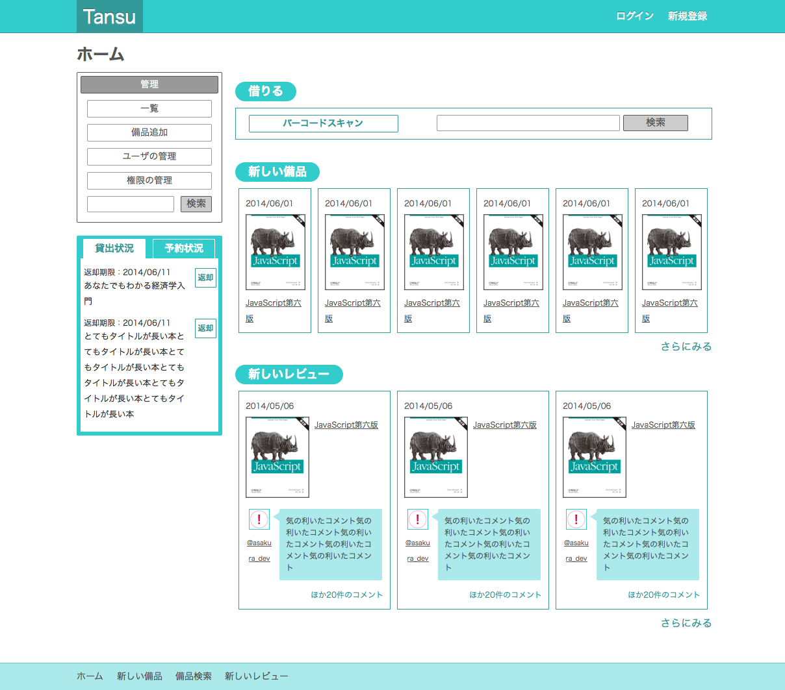

# Tansu


備品管理サービス
## インストール
[Ruby - rbenv インストールから Bundler を使用した Rails のローカルインストールと起動まで - Qiita](http://qiita.com/egopro/items/aba12261c053eecd6d19)  
を参考に，
- rbenv
- ruby
- Bundler
- Ruby On Rails
をインストール

## 設定
### メール周り
```ruby
#./config/initializers/devise.rb  
config.mailer_sender = 'please-change-me-at-config-initializers-devise@example.com'  
```
メールアドレス部分を好みに変更(メールを送信するアドレスが良いです)
この部分に指定されたメールアドレスが，登録メールのデフォルトの返信先になります．
```ruby
#./config/environments/production.rb および ./config/environments/development.rb の末尾あたり
  config.action_mailer.default_url_options = { :host =>
    'localhost:3000' }
  config.action_mailer.smtp_settings = {
    :address => ENV["SMTP_ADDRESS"],
    :port => ENV["SMTP_PORT"],
    :authentication => :plain,
    :user_name => ENV["SMTP_USER_NAME"],
    :password => ENV["SMTP_PASSWORD"]
  }
```
メールの送信に必要な情報を設定してください．
localhost:3000の部分を"あなたのホスト名:ポート番号"に変更してください。

### Twiiterログイン
```ruby
#./config/initializers/devise.rb 230行目あたり  
config.omniauth :twitter, ENV["TWITTER_CONSUMER_KEY"], ENV["TWITTER_CONSUMER_SECRET"]
```
[Twitter Application Management](https://apps.twitter.com/)よりアプリを作成し，各キーを取得して設定してください．  
アプリ作成の際のCallback URLは "http://あなたのホスト名/users/auth/twitter/callback"にしてください．

### Githubログイン
```ruby
#./config/initializers/devise.rb 230行目あたり  
config.omniauth :github , ENV["GITHUB_CONSUMER_KEY"], ENV["GITHUB_CONSUMER_SECRET"],
  :callback_url => "http://tansu.dev:3000/users/auth/github/callback"
```
[Authorized applications](https://github.com/settings/applications)より，アプリを作成し，各キーを取得して設定してください．  
アプリ作成の際のCallback URLは "http://あなたのホスト名/users/auth/github/callback"にしてください。  
また、"http://tansu.dev:3000/users/auth/github/callback" を "http://あなたのホスト名/users/auth/github/callback" に書き換えてください．

### Yahooショッピングの商品検索APIの設定
```ruby
#./config/application.rb 後ろあたり
    config.yahoo_application_id = ENV["YAHOO_APPLICATION_ID"]
  end
end
```
[Yahoo!デベロッパーネットワーク](http://developer.yahoo.co.jp/)より，アプリを作成し，アプリケーションIDを取得して設定してください．

## はじめてのログイン
新規登録よりアカウントを作成し、ログインしてください。  
最初に有効化されたアカウントがサービス開始時の"オーナー"になります。  
2人目以降のユーザーは、"オーナー"または"管理者"権限を持つユーザの承認を経て、Tansu内のサービスを利用することができるようになります。
